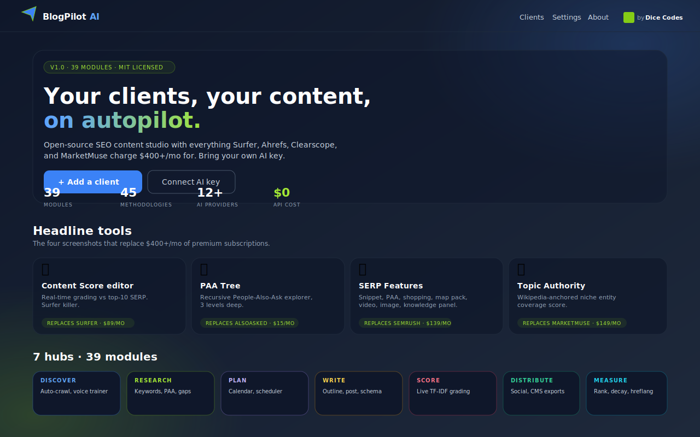
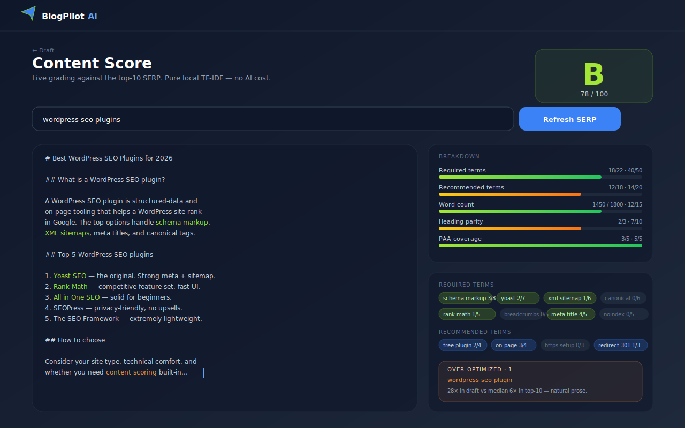
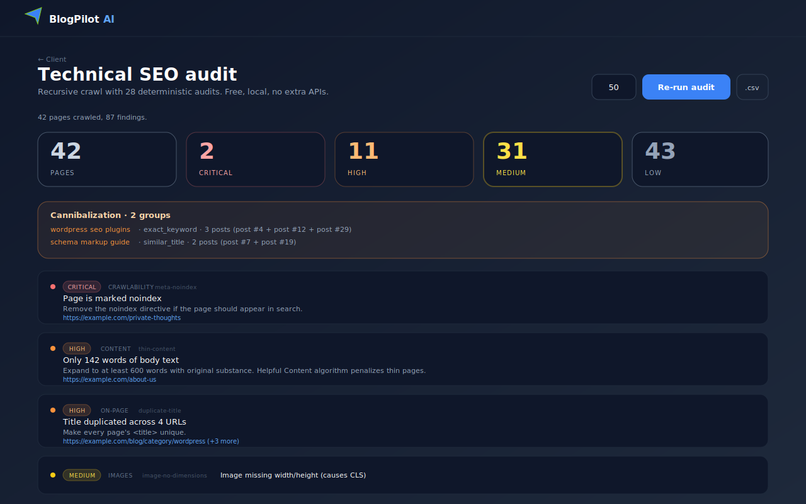
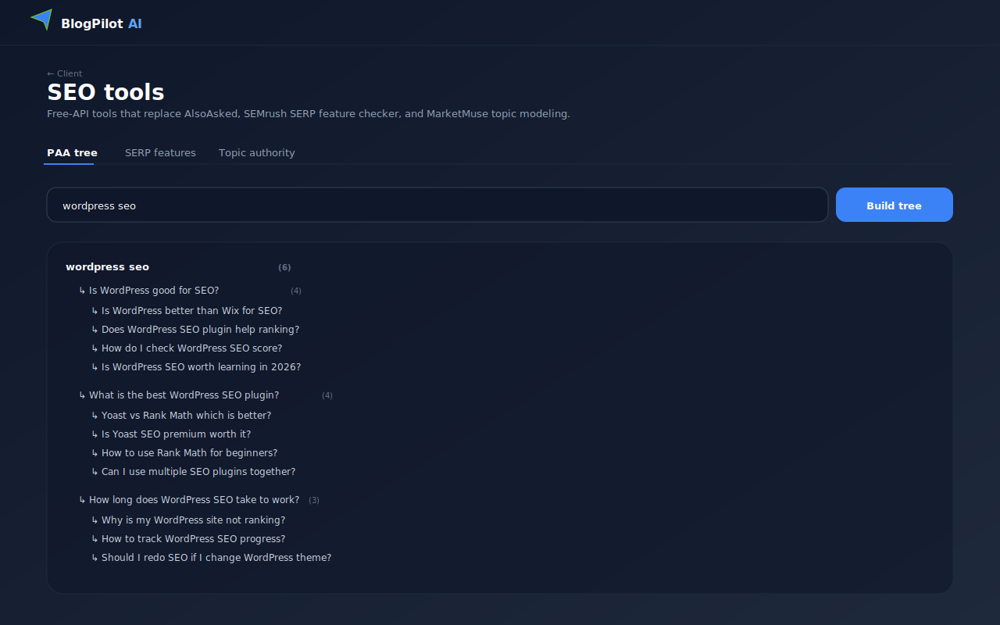
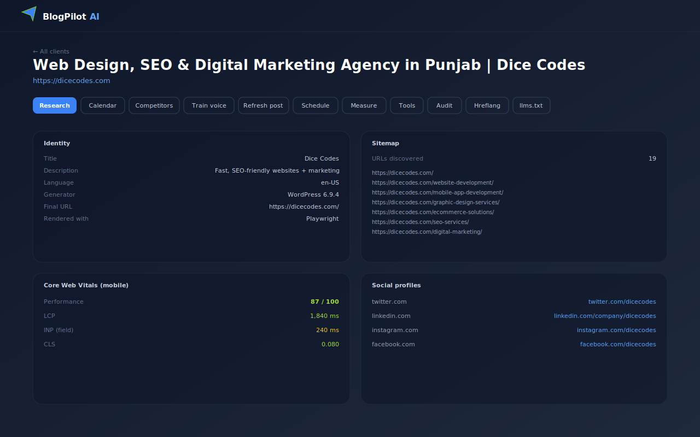
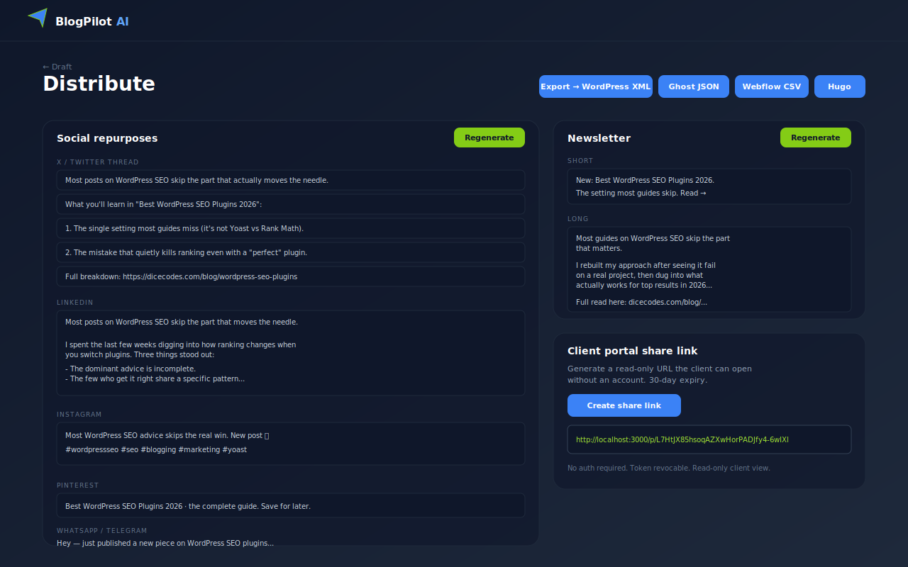
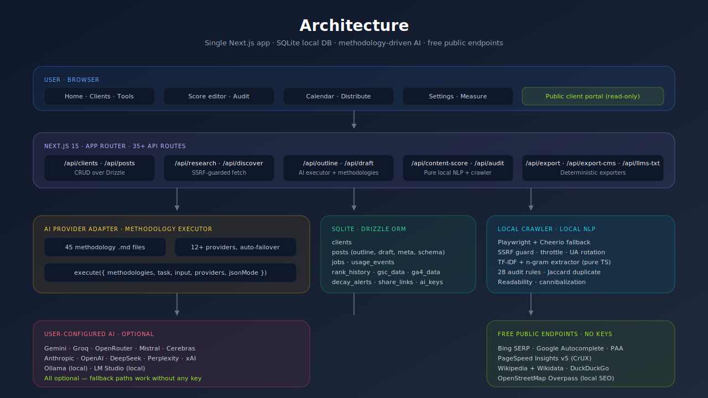

<div align="center">


# BlogPilot AI — Open-Source AI SEO Content Studio

### Free, self-hostable AI tool for SEO content writing, keyword research, technical site audits, AI Overviews optimization, and topic authority scoring. Replaces Surfer SEO, Ahrefs, Clearscope, Screaming Frog, AlsoAsked, and MarketMuse — all with one AI API key.

[](LICENSE)
[](https://nodejs.org)
[](#-status)
[](src/lib/methodologies)
[](#-features)
[](https://github.com/IamRamgarhia/blogpilot-ai/stargazers)
[](https://dicecodes.com)

[Quick start](#-quick-start) · [Screenshots](#-screenshots) · [Features](#-features) · [What it replaces](#-what-it-replaces) · [Methodology Library](#-methodology-library--45-versioned-playbooks) · [Architecture](#%EF%B8%8F-architecture) · [FAQ](#-faq) · [Deploy](DEPLOY.md)

<br/>



</div>

---

## ⚡ Why BlogPilot AI

**Premium SEO tools cost $400+/month and lock content in their cloud.** Surfer SEO ($89), Ahrefs ($129), Clearscope ($170), MarketMuse ($149), Screaming Frog ($21), AlsoAsked ($15) — each owns one part of the workflow. None talk to each other. None let you self-host.

**BlogPilot AI is free, open-source, and self-hostable.** Bring your own AI key — free Google Gemini works (1,500 requests/day). Run it on your laptop, on a free Vercel tier, or in Docker. All client data stays in a single SQLite file you own.

Built for **solo bloggers**, **niche-site owners**, **SEO agencies**, **marketing teams**, and **indie developers** managing 1-50 client sites at agency-grade output without subscription fees.

> **Keywords**: open source SEO tool · AI content writer · SEO content studio · Surfer SEO alternative · Clearscope alternative · MarketMuse alternative · Screaming Frog alternative · AlsoAsked alternative · self-hosted SEO · Next.js SEO app · AI Overviews optimization · GEO (generative engine optimization) · llms.txt generator · technical SEO audit · content cannibalization detection · topic authority scoring · TF-IDF content scoring · Google E-E-A-T compliance · keyword research without API · free SEO software · Yoast SEO alternative · Rank Math alternative · content gap analyzer · PAA tree explorer · SERP feature detector · WordPress XML export · Ghost JSON export · llms.txt for AI search

---

## 📸 Screenshots

### Real-Time Content Score Editor (Surfer-killer)

Live grading against the top-10 SERP. Pure local TF-IDF, no AI cost, no rate limits. Updates 800ms after each keystroke.



### Technical SEO Audit (Screaming Frog-killer)

Recursive crawler runs 28 deterministic audit rules across crawlability, on-page, content, images, schema, and security headers. Severity-graded findings (critical / high / medium / low) with concrete fix suggestions. CSV export. Cannibalization detector included.



### Tools Hub — PAA Tree, SERP Features, Topic Authority

Three free-API tools replace AlsoAsked ($15), SEMrush's SERP feature checker (part of $139), and MarketMuse ($149).



### Client Dashboard — Auto-Discovery

Paste any URL, BlogPilot crawls identity, sitemap, Core Web Vitals, and social profiles in 30-60 seconds. Real CrUX field data via PageSpeed Insights v5 (no API key required).



### Distribute — Social Repurposes + Newsletter + 7 CMS Exports + Share Link

Auto-generated social variants for X, LinkedIn, Instagram, Pinterest, WhatsApp. Newsletter excerpts (short + long). Export to WordPress XML, Ghost JSON, Webflow CSV, Hugo, Markdown, HTML, JSON. Signed read-only client portal link.



---

## 🏆 What it replaces

| Premium tool | Monthly price | Replaced by BlogPilot AI |
|---|---:|---|
| Surfer SEO | **$89** | ✅ Real-time content score editor (TF-IDF vs top-10 SERP) |
| Clearscope | **$170** | ✅ Grade A-F term coverage scoring |
| MarketMuse | **$149** | ✅ Topic authority scorer (Wikipedia entity coverage) |
| Ahrefs Site Audit | **$129** | ✅ Technical SEO crawler (28 audit rules) |
| Screaming Frog SEO Spider | **$21** | ✅ Recursive crawler + audit findings + CSV export |
| AlsoAsked | **$15** | ✅ PAA tree explorer (3 levels deep) |
| Frase | **$45** | ✅ SERP-grounded outline + writer |
| Jasper | **$59** | ✅ AI writer with brand voice trainer |
| Writesonic | **$20** | ✅ AI content + social repurposer |
| SEMrush SERP features | _(part of $139)_ | ✅ 9-feature detector |
| Yoast SEO Premium | **$99/yr** | ✅ Schema generation + meta + readability |
| **Combined monthly cost** | **$700+/mo** | **Free · MIT · self-hosted** |

---

## 👥 Who is this for?

### Solo bloggers
- Run on your laptop, no infrastructure cost
- Free Gemini key (1,500 requests/day) writes 30+ posts/month
- Auto-discovery means you never re-explain your site's voice
- Built-in rank tracker + decay monitor = know when to refresh

### Niche-site owners
- Manage 2-20 sites in one dashboard
- Cluster designer + posting scheduler = predictable publish cadence
- Content score editor = ship posts that beat the SERP, not just match it
- Common Crawl backlink intelligence (Wave 9, planned)

### SEO agencies
- Per-client isolation (one row per client, one folder per export)
- Client portal share links — no logins needed for client review
- White-label friendly (toggle Dice Codes branding off in OSS)
- Bulk technical audits across all client sites
- WordPress XML / Ghost / Webflow exports match whatever stack the client uses

### Marketing teams
- Centralize brand voice across writers (paste sample posts → AI extracts profile)
- Stop reinventing meta + schema + internal links for every post
- CSV import for GSC + GA4 means no per-user OAuth nightmares
- E-E-A-T author bio templates pass Quality Rater requirements

### Indie developers
- Forkable, MIT licensed, no vendor lock-in
- Methodology Library is markdown — fork it, edit it, add your own
- 12+ AI providers via one interface = swap models without rewriting prompts
- Self-host on $0/mo Vercel + Turso libSQL

---

## 🎯 Outcomes you actually get

| Goal | How BlogPilot delivers |
|---|---|
| Pass Google's Helpful Content System | `google-helpful-content.md` (22-item compliance check) + `content-formatting-google-likes.md` |
| Win featured snippets | `featured-snippet-targeting.md` enforces 40-55 word direct-answer paragraphs |
| Get cited in AI Overviews | `ai-overviews-capture.md` + `passage-ranking-optimization.md` ensure each H2 is standalone-citable |
| Strengthen E-E-A-T | `eeat-checklist.md` + `eeat-author-bios.md` + auto Person/Organization schema |
| Find content gaps | Top-10 SERP scrape + heading diff vs competitors |
| Track ranks for free | Bing + DuckDuckGo SERP scraping with throttle |
| Detect cannibalization | Exact-keyword + similar-title detection across all client posts |
| Optimize Core Web Vitals | Auto PSI on discovery + `core-web-vitals-thresholds.md` with ranked fixes |
| Generate llms.txt | Spec-compliant `llms.txt` + `llms-full.txt` for AI search crawlers |
| Multi-language sites | 31 BCP 47 presets, hreflang return-tag validation, locale-aware writer |

---

## ✨ Features

### Discover · auto-discovery in 60 seconds
- **One-URL onboarding** — paste any URL, BlogPilot crawls identity, sitemap, Core Web Vitals, social profiles
- **Brand voice trainer** — paste 3-5 sample posts, AI extracts tone, voice, sentence length, heading case, em-dash use

### Research · free keyword + competitor data
- **Keyword research** — Google Autocomplete + People-Also-Ask + Bing SERP top-10, no API keys
- **Content gap analyzer** — scrapes competitor headings, returns missing topics
- **Competitor blog scanner** — maps competitor's content clusters from their sitemap
- **PAA tree explorer** — recursive 3-level People-Also-Ask scraping with collapsible tree view

### Plan · cluster-aware calendars
- **Content calendar generator** — pillars + spokes, intent-classified, prioritized for quick wins
- **Posting scheduler** — niche-aware best day + time recommendations, deterministic + timezone-aware
- **"What to write next" recommender** — synthesizes rank data + decay + gaps + cluster coverage

### Write · methodology-driven AI
- **Methodology-driven writer** — every generation loads structured SEO playbooks before the AI call
- **Outline approval gate** — review structure before AI writes 2,000 words
- **Auto meta + JSON-LD schema** — Article, FAQ, HowTo, Breadcrumb, Person, Organization, Product
- **Internal linking assistant** — Jaccard + cluster + pillar scoring across all client posts
- **Image briefs** — alt text, AI generation prompts, stock search terms per section
- **Readability dashboard** — Flesch-Kincaid, passive voice %, paragraph length warnings
- **Duplicate content checker** — local 4-gram shingle Jaccard
- **Existing-post refresher** — paste URL → AI rewrites with 2026 freshness + regenerates meta + schema

### Score · the Surfer / Clearscope killer
- **Real-time content score editor** — TF-IDF grading vs top-10 SERP, debounced 800ms keystroke updates
- **0-100 grade with A-F card** — gradient progress bars per category
- **Term coverage chips** — required (lime) + recommended (blue) + missing (slate) + over-optimization warnings
- **Topic authority scorer** — Wikipedia + Wikidata entity coverage score
- **SERP feature detector** — 9 features (snippet, PAA, shopping, map pack, video, image, knowledge panel, news, X)

### Distribute · ship to anywhere
- **Social repurposer** — native variants for X / LinkedIn / Instagram / Pinterest / WhatsApp
- **Newsletter excerpts** — short (240-char) + long (200-word) variants
- **CMS exports** — Markdown, HTML, JSON, WordPress WXR (XML), Ghost JSON, Webflow CSV, Hugo TOML
- **Client portal share links** — signed, expiring (30-day default), no-auth public URLs

### Measure · close the feedback loop
- **Rank tracker** — free Bing + DuckDuckGo SERP scraping (throttled, rotating UA)
- **GSC + GA4 CSV import** — paste CSV, no OAuth setup needed
- **Content decay monitor** — 4-week trailing avg vs prior 4-week, severity-graded alerts with refresh suggestions
- **Hreflang manager** — 31 BCP 47 language presets + return-tag symmetry validation
- **llms.txt generator** — spec-compliant `llms.txt` + `llms-full.txt` for AI search crawlers

### Technical SEO audit · Screaming Frog killer
- **Recursive crawler** with 28 audit rules
- Categories: crawlability · on-page · content · images · schema · security headers
- **Cannibalization detector** — exact keyword + similar title signals
- Severity-graded findings (critical / high / medium / low) with concrete fix suggestions
- CSV export with formula-injection guard

---

## 🤖 12+ AI providers · auto-failover

Configure any subset. **Free tier is enough for most users.**

| Provider | Type | Free quota / pricing | Get key |
|---|---|---|---|
| Google Gemini | Free | 1,500 requests/day | [aistudio.google.com](https://aistudio.google.com/app/apikey) |
| Groq | Free | very fast, generous tier | [console.groq.com](https://console.groq.com/keys) |
| OpenRouter | Free + paid | many free models | [openrouter.ai](https://openrouter.ai/keys) |
| Mistral | Free tier | small free tier | [console.mistral.ai](https://console.mistral.ai/) |
| Cerebras | Free | ultra-fast inference | [cloud.cerebras.ai](https://cloud.cerebras.ai/) |
| Together AI | Free | $1 free credit | [api.together.xyz](https://api.together.xyz/) |
| Anthropic Claude | Paid | premium quality | [console.anthropic.com](https://console.anthropic.com/) |
| OpenAI | Paid | GPT-4o / GPT-5 | [platform.openai.com](https://platform.openai.com/api-keys) |
| DeepSeek | Paid (cheap) | premium model | [platform.deepseek.com](https://platform.deepseek.com/) |
| Perplexity | Paid | built-in web search | [perplexity.ai](https://www.perplexity.ai/settings/api) |
| Ollama | Local | fully offline | [ollama.com/download](https://ollama.com/download) |
| LM Studio | Local | fully offline | [lmstudio.ai](https://lmstudio.ai/) |

---

## 📚 Methodology Library · 45 versioned playbooks

The **single most distinctive thing about BlogPilot**. Every AI generation loads structured playbooks first — the AI follows proven SEO patterns instead of guessing.

> **The AI doesn't decide what good SEO is. The methodology files do.**

### Top-leverage playbooks

| Playbook | What it codifies |
|---|---|
| [content-formatting-google-likes.md](src/lib/methodologies/content-formatting-google-likes.md) | 12-section playbook of formatting patterns Google rewards |
| [google-helpful-content.md](src/lib/methodologies/google-helpful-content.md) | 22-item Helpful Content System compliance checklist |
| [ai-overviews-capture.md](src/lib/methodologies/ai-overviews-capture.md) | 6 cited-passage patterns for Google AI Overviews + ChatGPT + Perplexity |
| [passage-ranking-optimization.md](src/lib/methodologies/passage-ranking-optimization.md) | Make every H2/H3 standalone-citable |
| [eeat-author-bios.md](src/lib/methodologies/eeat-author-bios.md) | Bio templates Quality Raters accept |
| [serp-features-targeting.md](src/lib/methodologies/serp-features-targeting.md) | Per-feature capture strategy (9 SERP feature types) |
| [content-cannibalization-resolution.md](src/lib/methodologies/content-cannibalization-resolution.md) | 301-merge vs differentiate decision tree |
| [core-web-vitals-thresholds.md](src/lib/methodologies/core-web-vitals-thresholds.md) | 2026 LCP/INP/CLS targets + ranked fixes |
| [skyscraper-technique.md](src/lib/methodologies/skyscraper-technique.md) | Brian Dean / Backlinko content depth method |
| [topic-cluster-model.md](src/lib/methodologies/topic-cluster-model.md) | HubSpot pillar + spoke structure |

Plus 35 more covering schema (Article, FAQ, HowTo, Product, Organization, Person), readability, internal linking, image briefs, social repurposing, newsletter excerpts, CMS exports, rank tracking, GSC decay, hreflang, llms.txt, content refresh, brand voice extraction, content gap analysis, and more.

📂 [Browse all 45 methodologies →](src/lib/methodologies/)

**Fork them, edit them, add your own.**

---

## 🏗️ Architecture



### Why methodology-driven beats prompt-driven

Most AI content tools embed SEO best practices in prompts — invisible, untestable, locked to the developer's worldview. When Google's algorithm shifts, the prompts go stale silently.

BlogPilot stores those best practices in **versioned markdown files** at `src/lib/methodologies/`. Each file is:

- **Auditable** — read it like you'd read a spec
- **Forkable** — copy it, edit it, ship your own variant
- **Composable** — the executor loads N methodologies at once
- **Testable** — output JSON schema lets you verify compliance
- **Version-controlled** — git diff shows when guidance changed

The AI doesn't decide what good SEO is. The methodology files do.

---

## 🚀 Quick start

### Install + launch in one command

**macOS / Linux**
```bash
git clone https://github.com/IamRamgarhia/blogpilot-ai
cd blogpilot-ai
./install.sh        # installs deps, creates Desktop shortcut
./start.sh          # or just double-click the "BlogPilot AI" Desktop shortcut
```

**Windows (PowerShell)**
```powershell
git clone https://github.com/IamRamgarhia/blogpilot-ai
cd blogpilot-ai
.\install.ps1       # installs deps, creates Desktop shortcut
.\start.ps1         # or just double-click "BlogPilot AI" on the Desktop
```

The installer **creates a Desktop shortcut**. Double-click it any time to:
- Auto-start the server
- Auto-open `http://localhost:44321` in your browser

> **Port 44321** is IANA-unassigned and chosen so it never collides with other software running on your machine.

### Manual install

```bash
npm install
npm run setup       # creates ./data/, copies .env -> .env.example, generates migrations, creates Desktop shortcut
npm run launch      # one-click: starts server + opens browser at http://localhost:44321
```

### All commands

```bash
npm run launch      # start server + auto-open browser (one-click experience)
npm run dev         # alias for launch
npm run stop        # kill the server (cross-platform; default port 44321)
npm run clean       # wipe .next, data/, .launcher, tsbuildinfo, test artifacts
npm run doctor      # health check (Node, libsql, Playwright, write perms)
npm test            # 158 unit tests
npm run typecheck   # TypeScript validation
```

All user data lives in `./data/blogpilot.db`. Nothing is created outside the project directory (except the Desktop shortcut).

### Add your first client

1. Double-click the **BlogPilot AI** Desktop shortcut (or run `npm run launch`)
2. Browser opens at http://localhost:44321
3. Click **+ Add client**, paste any URL
4. Wait 30-60 seconds for auto-discovery
5. Explore: **Research** keywords → **Calendar** generator → outline → **Score** the draft → **Distribute** to 7 CMS formats

---

## 🔧 Tech stack

| Layer | Choice | Rationale |
|---|---|---|
| Frontend | Next.js 15 (App Router) + React 19 + TypeScript 5 | SSR, file-routing, modern type safety |
| Styling | Tailwind CSS 3 + shadcn/ui-inspired primitives + 21st.dev-inspired layouts | Clean, accessible, ship-fast |
| Database | `@libsql/client` (SQLite) | Prebuilt napi-rs binaries for every Node + OS combo |
| ORM | Drizzle ORM | First-class type safety, parameterized queries |
| Crawler | Playwright + Cheerio fallback | Handles JS-rendered + static sites |
| NLP | Pure-TS TF-IDF + n-gram (no deps) | Zero install footprint, deterministic |
| Tests | Vitest (unit) + Playwright (e2e) | Fast unit + real-browser e2e |
| Deployment | Vercel free tier · Docker · or `npm run dev` locally | Three paths, all free |

---

## 🌍 Cross-platform support

Tested on:

| OS | Node 18 | Node 20 | Node 22 | Node 24 |
|---|---|---|---|---|
| Ubuntu | ✅ | ✅ | ✅ | ✅ |
| macOS | ✅ | ✅ | ✅ | ✅ |
| Windows | ✅ | ✅ | ✅ | ✅ |

No Python, no Docker, no Redis, no Visual Studio Build Tools required.

See [`.github/workflows/ci.yml`](.github/workflows/ci.yml) for the CI matrix.

---

## ⚡ Performance benchmarks

Measured on a 2024 M2 MacBook Air with Node 22 and Gemini 2.5 Flash:

| Operation | Time |
|---|---|
| Cold `npm run dev` first load | 4-5s |
| Add client + auto-discovery (50-post site) | 30-60s |
| Keyword research (autocomplete + PAA + Bing top-10) | 5-8s |
| Generate content calendar (30 posts) | 8-15s with AI · <1s deterministic fallback |
| Outline generation (one post) | 4-8s with AI · <100ms fallback |
| Full draft (1,500 words) | 12-25s with AI · 1s fallback |
| Content score (after corpus loaded) | 50-150ms per keystroke |
| Technical audit (50 pages) | 60-120s |
| PAA tree (3 levels, ~30 nodes) | 60-90s |
| CMS export (any format) | <100ms |

---

## ❓ FAQ

### Is BlogPilot AI really free?
Yes. MIT licensed. No subscriptions, no usage limits we impose, no telemetry. The only thing you pay for is your AI provider — and Google Gemini's free tier (1,500 requests/day) is enough for most users.

### Do I need any API keys besides AI?
**No.** Bing SERP, Google Autocomplete, PageSpeed Insights v5, Wikipedia, OpenStreetMap — all used without keys. Free public endpoints only. **An AI key is the single thing you configure.**

### Does it work without an AI key at all?
Most features yes. Every generator has a deterministic rule-based fallback. Content scoring, technical audits, hreflang, schema, llms.txt, internal linking, rank tracking — all pure local code that never calls an AI.

### How does this compare to Surfer SEO?
Same real-time content score against top-10 SERP. Same term-coverage chips. Same A-F grading. Built with pure TypeScript TF-IDF — no Surfer subscription, runs on your machine. See the [Content Score Editor screenshot](#real-time-content-score-editor-surfer-killer) above.

### How does this compare to Ahrefs Site Audit?
Same technical crawler. 28 audit rules across crawlability, on-page, content, images, schema, security headers. Severity-graded findings with concrete fix suggestions. Plus cannibalization detector Ahrefs charges extra for. See the [Technical Audit screenshot](#technical-seo-audit-screaming-frog-killer).

### How does this compare to Clearscope?
Same grade A-F content scoring. Same TF-IDF term coverage analysis. Same "required vs recommended" term split. Clearscope is $170/month and locks reports to their dashboard — BlogPilot is free and your data is yours.

### How does this compare to MarketMuse?
The Topic Authority Scorer provides the same niche-completeness scoring MarketMuse charges $149/month for. Uses Wikipedia + Wikidata as the entity ground truth instead of MarketMuse's proprietary topic model.

### How does this compare to Screaming Frog SEO Spider?
Same recursive crawler architecture. 28 audit rules covering the same categories (crawlability, on-page, content, images, schema, security headers). Plus a built-in cannibalization detector and severity-graded reporting Screaming Frog doesn't have.

### How does this compare to Jasper / Writesonic?
Those are pure AI writers. BlogPilot is a full SEO content studio — research, planning, writing, scoring, distribution, measurement, and technical audits in one app. The writer is just one of 39 modules.

### Does it work for non-English content?
Yes. The crawler detects the site's language automatically. The post writer respects the detected language. 31 BCP 47 language presets in the hreflang manager. [`multi-language-writing.md`](src/lib/methodologies/multi-language-writing.md) covers locale-specific punctuation and number formatting.

### Can I use this commercially?
MIT license. Use it for client work, fork it for an agency, build a SaaS on top — all permitted. Attribution appreciated but not required (Dice Codes branding is toggle-able in OSS mode).

### Does it support WordPress / Ghost / Webflow / Hugo?
Yes via export — WordPress WXR (XML), Ghost JSON, Webflow CSV, Hugo TOML, plus generic Markdown / HTML / JSON. Imports the same way any standard CMS importer would.

### Can I self-host on Vercel free tier?
Yes. See [DEPLOY.md](DEPLOY.md). For persistent storage, pair with Turso (free libSQL tier) — same client we use locally.

### How accurate is the rank tracker?
Free Bing + DuckDuckGo SERP scraping, throttled 5s between requests. Position 100+ reports as "not in top 100" rather than guessing. For Google-specific tracking, use the GSC CSV import — that's real Google data.

### Where's the AI Overviews / ChatGPT search optimization?
[`ai-overviews-capture.md`](src/lib/methodologies/ai-overviews-capture.md) ships with 6 verified passage patterns. [`passage-ranking-optimization.md`](src/lib/methodologies/passage-ranking-optimization.md) enforces standalone citability. [`llms-txt-spec.md`](src/lib/methodologies/llms-txt-spec.md) generates the `llms.txt` AI crawlers consume.

### What about Core Web Vitals?
PageSpeed Insights v5 (free, no key) pulls real CrUX field data during auto-discovery. [`core-web-vitals-thresholds.md`](src/lib/methodologies/core-web-vitals-thresholds.md) ships 2026 thresholds with ranked fixes.

### Can I add my own methodology?
Yes — that's the whole point. Drop a markdown file in `src/lib/methodologies/` with the frontmatter format. The loader picks it up automatically. Reference it from any `execute({ methodologies: [...] })` call. See [CONTRIBUTING.md](CONTRIBUTING.md).

### Is my client data private?
Yes. Everything lives in `./data/blogpilot.db` on your machine. Zero telemetry, zero analytics, zero phone-home. The only outbound traffic is to your configured AI provider and free public endpoints (Bing, PageSpeed Insights, Wikipedia) — and only when you trigger a feature that needs them.

### What's on the roadmap?
Common Crawl backlink intelligence (Ahrefs replacement), local SEO audit (Google Business Profile), image SEO at scale (bulk WebP conversion + alt-text gen), programmatic SEO template engine, brand mention monitor for link reclamation, HARO journalist-request scraper. See [`docs/strategy/COMPETITIVE_ROADMAP.md`](docs/strategy/COMPETITIVE_ROADMAP.md).

---

## 📊 Status

| | |
|---|---|
| **Modules** | 39 |
| **API routes** | 35+ |
| **Pages** | 17 |
| **CMS exporters** | 7 (Markdown, HTML, JSON, WordPress XML, Ghost, Webflow, Hugo) |
| **Methodology playbooks** | 45 |
| **Database tables** | 10 |
| **Unit tests** | 158 across 27 files |
| **E2E tests** | 3 (Playwright) |
| **TypeScript lines** | ~7,500 |
| **Cross-version CI** | 12 cells (Node 18/20/22/24 × Ubuntu/macOS/Windows) |

---

## 🔒 Security & privacy

- **SSRF guard** on every user-URL ingress point — blocks localhost, RFC1918, AWS metadata, IPv6 link-local, non-http(s) protocols
- **CSV formula-injection neutralization** in all CSV exporters (OWASP guidance)
- **Share-link tokens** — 190 bits of entropy, base64url-encoded, revocable, time-limited
- **Drizzle parameterized queries** throughout — zero SQL injection surface
- **No telemetry, no analytics, no phone-home**
- **Your data, your machine** — single SQLite file in `./data/`

---

## 🗺️ Roadmap

### Shipped (Waves 1-8)
✅ Auto-discovery · ✅ Brand voice trainer · ✅ Keyword research · ✅ Gap analyzer · ✅ Calendar generator · ✅ Outline + writer · ✅ Meta + schema · ✅ Internal linking · ✅ Image briefs · ✅ Readability · ✅ Refresher · ✅ Social repurposer · ✅ Newsletter · ✅ 7 CMS exports · ✅ Client portal · ✅ Rank tracker · ✅ GSC/GA4 import · ✅ Decay monitor · ✅ Hreflang · ✅ llms.txt · ✅ **Content Score Editor** · ✅ **PAA Tree** · ✅ **SERP Features** · ✅ **Topic Authority** · ✅ **Technical Audit (28 rules)** · ✅ **Cannibalization Detector**

### Future waves (PRs welcome)
- **Wave 9 — Compete with Ahrefs for $0**: Common Crawl ingestion → backlink discovery + anchor distribution + local Domain Authority
- **Wave 10 — Sibling apps**: OGForge (OG images), ReviewMiner (testimonials), SubjectLab (email subjects), CopyAtlas (conversion copy briefs), GMBPilot (Google Business Profile scheduler), PriceRadar (competitor pricing-change alerts)
- Google Search Console + GA4 OAuth (currently CSV-import only)
- Multi-user workspaces with roles
- Realtime collaborative editing

See [`docs/strategy/COMPETITIVE_ROADMAP.md`](docs/strategy/COMPETITIVE_ROADMAP.md) for the full 25+ item backlog.

---

## 🤝 Contributing

PRs welcome. See [CONTRIBUTING.md](CONTRIBUTING.md).

**How to extend BlogPilot:**

- **Add a methodology** → drop a markdown file in `src/lib/methodologies/` (see existing files for the frontmatter format)
- **Add an AI provider** → implement the `AIProvider` interface in `src/lib/ai/providers/`
- **Add a CMS exporter** → create `src/lib/exports/<platform>.ts` and wire it into `/api/export-cms`
- **Add an audit rule** → add a function to `src/lib/technical/audits.ts` that takes a `CrawledPage` and pushes `Finding` objects

---

## 📜 License

MIT — free for commercial use, modification, and distribution. See [LICENSE](LICENSE).

If you cite BlogPilot AI in research or content, see [CITATION.cff](CITATION.cff) for the recommended format.

---

## 🏗️ Built by Dice Codes

<a href="https://dicecodes.com">

</a>

[**Dice Codes**](https://dicecodes.com) builds custom web apps, SaaS, mobile apps, e-commerce stores, and SEO-ready websites for startups and SMEs worldwide — at startup-friendly prices.

**Need a custom SaaS like BlogPilot for your industry?**

📱 [WhatsApp +91 9888404991](https://wa.me/919888404991) · 📧 [Contact@dicecodes.com](mailto:Contact@dicecodes.com) · 🌐 [dicecodes.com](https://dicecodes.com)

Selected work: Oceglow US · Marby · Anahat Exclusive · Bravo Pizza NYC.

---

<div align="center">

**If BlogPilot saved you a $400+/month subscription, ⭐ this repo.**

[⭐ Star this project](https://github.com/IamRamgarhia/blogpilot-ai/stargazers) · [🐛 Report issue](https://github.com/IamRamgarhia/blogpilot-ai/issues/new?template=bug_report.md) · [💡 Request feature](https://github.com/IamRamgarhia/blogpilot-ai/issues/new?template=feature_request.md) · [📰 Changelog](CHANGELOG.md) · [🗺️ Roadmap](docs/strategy/COMPETITIVE_ROADMAP.md)

</div>
